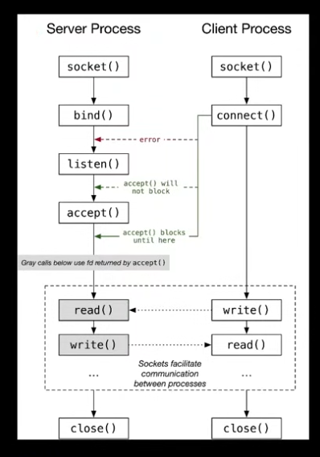

# Funcoes relacionadas com Socket:

---
## O que sao sockets?
**Sockets sao uma abstracao providenciada pelo OS para permitir comunicacao entre processos diferentes, seja na mesma maquina ou atraves de uma network**

**Eles agem como endpoints em two-way communication channels, entao quando duas aplicacoes precisam se comunicar (estando na mesma maquina ou atraves da internet) cada uma precisara ter um socket aberto**

**E um socket eh essencialmente um software construct que contem uma combinacao de protocolo (TCP no nosso caso), um endereco IP e uma porta**

### Existem 2 tipos principais de Sockets: TCP e UDP
**TCP (Transmission Control Protocol) Socket:**
 - orientado a conexao
 - a transmissao de dados eh ordenada, confiavel e previnida de erros

**UDP (User Datagram Protocol):**
 - nao tem conexao
 - nao eh confiavel
 - envia os diagramas de dados para o IP e porta sem nenhuma confirmacao
 - nao ha nenhuma garantia de entrega, ordenamento ou integridade
 - ***entretanto ele eh muito mais rapido e mais leve (ideal para real-time apps, streams, videogames, etc)*** 

## Socket life-cycle:



---

## 🔌 1. `socket`

**Cria um novo socket.**
```cpp
int socket(int domain, int type, int protocol);
```
 - domain: família de endereços (AF_INET, AF_INET6, etc).

 - type: tipo de socket (SOCK_STREAM, SOCK_DGRAM).

 - protocol: normalmente 0 para padrão (TCP, UDP).

Retorno: descritor (≥ 0) em sucesso, -1 em erro.


---
## 🏷️ 2. bind

**Associa o socket a um endereço IP e porta.**
```cpp
int bind(int sockfd, const struct sockaddr *addr, socklen_t addrlen);
```
 - sockfd: descritor retornado por socket.

 - addr: ponteiro para estrutura sockaddr_in.

 - addrlen: tamanho da estrutura.

Retorno: 0 em sucesso, -1 em erro.

---
## 🕑 3. listen

**Coloca o socket no modo passivo (aguardando conexões).**
```cpp
int listen(int sockfd, int backlog);
```
 - sockfd: socket ligado com bind.

 - backlog: número de conexões pendentes.

Retorno: 0 em sucesso, -1 em erro.

---
## ✅ 4. accept
**Aceita uma nova conexão em um socket que esteja escutando.**
```cpp
int accept(int sockfd, struct sockaddr *addr, socklen_t *addrlen);
```
 - sockfd: socket em escuta.

 - addr: ponteiro para armazenar endereço do cliente.

 - addrlen: ponteiro para tamanho da estrutura.

Retorno: novo descritor de socket, ou -1 em erro.

---
## 🔌 5. connect
**Conecta o socket a um servidor remoto.**
```cpp
int connect(int sockfd, const struct sockaddr *addr, socklen_t addrlen);
```
 - sockfd: socket criado.

 - addr: endereço do servidor.

 - addrlen: tamanho da estrutura.

Retorno: 0 em sucesso, -1 em erro.

---
## 📨 6. send / recv
**Envia ou recebe dados pelo socket.**
```cpp
ssize_t send(int sockfd, const void *buf, size_t len, int flags);
ssize_t recv(int sockfd, void *buf, size_t len, int flags);
```
 - sockfd: descritor do socket.

 - buf: buffer com dados ou destino.

 - len: tamanho do buffer.

 - flags: geralmente 0.

Retorno: número de bytes transferidos, ou -1 em erro.

---
## 🔢 7. htons, htonl, ntohs, ntohl
**Conversões entre ordem de bytes da máquina e da rede.**
```cpp
uint16_t htons(uint16_t hostshort);
uint32_t htonl(uint32_t hostlong);
uint16_t ntohs(uint16_t netshort);
uint32_t ntohl(uint32_t netlong);
```
 - Usado para portas (16 bits) e endereços IP (32 bits).

Retorno: valor convertido.

---
## 8. getaddrinfo / freeaddrinfo
**Resolve hostnames e serviços em endereços utilizáveis.**
```cpp
int getaddrinfo(const char *node, const char *service, const struct addrinfo *hints,
struct addrinfo **res);
void freeaddrinfo(struct addrinfo *res);
```
 - node: nome ou IP do destino.

 - service: porta ou nome do serviço.

 - hints: preferências para o tipo de resultado.

 - res: resultado retornado.

Retorno: 0 em sucesso, ou código de erro.

---
## 🔠 9. gai_strerror
**Converte erro de getaddrinfo em string.**
```cpp
const char *gai_strerror(int errcode);
```
 - errcode: valor retornado por getaddrinfo.

Retorno: string com descrição do erro.

---
## ⚙️ 10. setsockopt
**Define opções para o socket.**
```cpp
int setsockopt(int sockfd, int level, int optname, const void *optval, socklen_t optlen);
```
 - sockfd: descritor do socket.

 - level: geralmente SOL_SOCKET.

 - optname: ex: SO_REUSEADDR.

 - optval: valor da opção.

 - optlen: tamanho do valor.

Retorno: 0 em sucesso, -1 em erro.

--
## 🏷️ 11. getsockname
**Obtém o endereço associado ao socket.**
```cpp
int getsockname(int sockfd, struct sockaddr *addr, socklen_t *addrlen);
```
 - addr: ponteiro para estrutura de resultado.

 - addrlen: tamanho da estrutura.

Retorno: 0 em sucesso, -1 em erro.

---
## 🔁 12. select
**Monitora múltiplos descritores.**
```cpp
int select(int nfds, fd_set *readfds, fd_set *writefds, fd_set *exceptfds, 
struct timeval *timeout);
```
 - nfds: maior descritor + 1.

 - readfds/writefds/exceptfds: conjuntos monitorados.

 - timeout: tempo limite.

Retorno: número de descritores prontos, 0 em timeout, -1 em erro.

---
## 🔁 13. epoll
**Alternativa mais eficiente que poll para monitorar múltiplos descritores.**

### Funcoes principais
#### 13.1 - Criacao do epoll
```cpp
int epoll_create1(int flags);
```
 - flags: Geralmente 0 ou EPOLL_CLOEXEC.

Retorno: Um file descriptor para o epoll, ou -1 em caso de erro.

#### 13.2 Adicionar/Remover/Modificar descritores:
```cpp
int epoll_ctl(int epfd, int op, int fd, struct epoll_event *event);
```
 - epfd: File descriptor do epoll.
 - op: Operação (EPOLL_CTL_ADD, EPOLL_CTL_MOD, EPOLL_CTL_DEL).
 - fd: File descriptor a ser monitorado.
 - event: Estrutura que define os eventos a serem monitorados.

#### 13.3 Esperar por eventos:
```cpp
int epoll_wait(int epfd, struct epoll_event events[], int maxevents, int timeout);
```
 - epfd: File descriptor do epoll.
 - events: Array de estruturas epoll_event para armazenar os eventos prontos.
 - maxevents: Número máximo de eventos a retornar.
 - timeout: Milissegundos (ou -1 para infinito).

Retorno: Número de eventos prontos, ou -1 em caso de erro.

### Obs:

**Estrutura epoll_event:**

```cpp
	struct epoll_event {
    	uint32_t events; // Eventos a monitorar (ex.: EPOLLIN, EPOLLOUT)
    	epoll_data_t data; // Dados associados ao descritor (ex.: fd)
	};
```
**Diferenças principais:**

 - Persistência: Ao contrário de poll, você não precisa passar a lista de descritores toda vez. Os descritores são registrados no epoll com epoll_ctl.
 - Escalabilidade: Melhor desempenho com muitos descritores, pois usa uma estrutura baseada em eventos.

**Exemplo básico:**

 - Crie o epoll com epoll_create1.
 - Adicione descritores com epoll_ctl.
 - Espere por eventos com epoll_wait.

---
## 🛠️ 14. fcntl
**Manipula opções do descritor (ex: não bloqueante).**
```cpp
int fcntl(int fd, int cmd, ...);
```
 - cmd: F_SETFL, F_GETFL, etc.

 - Usado com O_NONBLOCK para E/S não bloqueante.

Retorno: depende da operação, -1 em erro.

---
## ❌ 15. close
**Fecha um socket.**
```cpp
int close(int fd);
```
 - fd: descritor (ex: socket).

Retorno: 0 em sucesso, -1 em erro.

---
## 🔄 16. socketpair
**Cria par de sockets conectados entre si (IPC).**
```cpp
int socketpair(int domain, int type, int protocol, int sv[2]);
```
 - sv: array com dois descritores conectados.

Retorno: 0 em sucesso, -1 em erro.

---
## 🌐 17. getprotobyname
**Obtém estrutura de protocolo a partir do nome.**
```cpp
struct protoent *getprotobyname(const char *name);
```
 - name: "tcp", "udp", etc.

Retorno: ponteiro para estrutura protoent, ou NULL em erro.